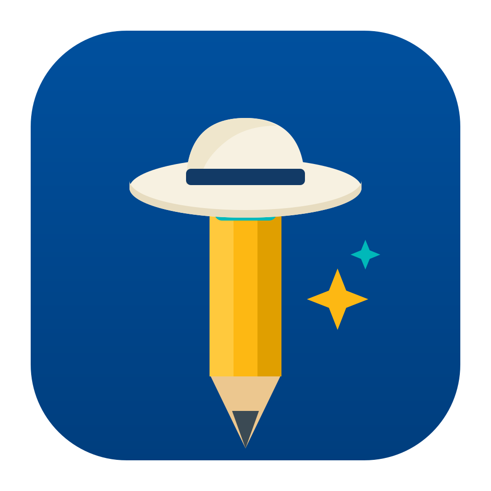

<div align="center">
  
  <h1>MinutIA</h1>
  <p><strong>Un producto de Impulso IA</strong></p>
  <p>
    Convierte reuniones en transcripciones, minutas y acuerdos claros con inteligencia artificial.
  </p>
  <p>
    Diseñado para equipos y profesionales que necesitan ordenar conversaciones, acelerar el seguimiento y trabajar con más claridad.
  </p>
  <p>
    <a href="https://github.com/nikopradopalma17-art/Minut_IA/releases/latest"><strong>Descargar MinutIA para Windows</strong></a>
    ·
    <a href="https://github.com/nikopradopalma17-art/Minut_IA/releases">Ver releases</a>
    ·
    <a href="docs/BUILDING.md">Documentación técnica</a>
  </p>
  <p>
    
    
    
    
  </p>
</div>

## Qué es MinutIA

MinutIA es un asistente de reuniones creado por Impulso IA para transformar conversaciones de trabajo en información útil y accionable.

Te ayuda a grabar reuniones, transcribir contenido, generar minutas y organizar acuerdos sin depender de flujos manuales dispersos. El objetivo es simple: reducir el tiempo entre una reunión y una acción clara.

## Por qué MinutIA

- **Más claridad después de cada reunión.** Convierte audio en transcripciones, resúmenes y compromisos más fáciles de revisar.
- **Más control sobre tu información.** Prioriza el procesamiento local para organizaciones y profesionales que valoran privacidad y trazabilidad.
- **Más velocidad operativa.** Reduce el trabajo repetitivo de ordenar notas, redactar actas y recuperar decisiones.
- **Más flexibilidad.** Puedes trabajar con modelos locales o conectar proveedores externos según tu flujo.

## Qué puedes hacer con MinutIA

- Grabar reuniones desde tu equipo.
- Obtener transcripción en tiempo real.
- Generar minutas con IA a partir de la conversación.
- Reprocesar audios con distintos modelos o ajustes.
- Centralizar reuniones, minutas y seguimiento en una sola aplicación.

## Instalación

### Windows

1. Ve a [Releases](https://github.com/nikopradopalma17-art/Minut_IA/releases/latest).
2. Descarga el instalador más reciente para Windows.
3. Ejecuta el instalador.
4. Si Windows SmartScreen muestra la advertencia de editor desconocido, haz clic en `Más información` y luego en `Ejecutar de todas formas`.
5. En el primer inicio, mantén conexión a internet mientras MinutIA descarga el modelo de transcripción necesario.

### macOS

El soporte de empaquetado también existe en el proyecto. Puedes revisar las versiones disponibles desde [Releases](https://github.com/nikopradopalma17-art/Minut_IA/releases).

### Linux

Para Linux, la ruta recomendada sigue siendo compilar desde código fuente. Las instrucciones están en [docs/BUILDING.md](docs/BUILDING.md) y [docs/building_in_linux.md](docs/building_in_linux.md).

## Vista del producto

### Inicio y panel principal


### Generación de minutas


### Configuración y control del entorno


## Enfoque del producto

MinutIA forma parte de la visión de Impulso IA: optimizar procesos de trabajo con soluciones de inteligencia artificial aplicadas, claras y útiles.

Por eso el producto está orientado a:

- equipos que necesitan mejor seguimiento de reuniones
- profesionales que trabajan con información sensible
- organizaciones que buscan eficiencia sin sumar fricción
- flujos donde la IA debe aportar resultado, no ruido

## Tecnología y privacidad

MinutIA está construida como una aplicación de escritorio con `Tauri`, `Rust`, `Next.js` y `TypeScript`.

En la capa de transcripción y resumen, el proyecto soporta distintos motores y proveedores para adaptarse a necesidades reales de operación. El procesamiento local es una prioridad del producto, especialmente para escenarios donde privacidad, velocidad y control importan.

## Para desarrollo

Si quieres ejecutar MinutIA localmente o contribuir al producto:

```bash
git clone https://github.com/nikopradopalma17-art/Minut_IA
cd Minut_IA/frontend
pnpm install
pnpm run tauri:dev
```

Guías útiles:

- [docs/BUILDING.md](docs/BUILDING.md)
- [docs/building_in_linux.md](docs/building_in_linux.md)
- [docs/architecture.md](docs/architecture.md)

## Impulso IA

MinutIA es un producto de **Impulso IA**, orientado a transformar la forma de trabajar mediante inteligencia artificial, optimización de procesos y soluciones digitales ágiles.

Si necesitas adaptar MinutIA a un flujo interno o a un contexto organizacional específico, este repositorio puede servir como base técnica del producto.

## Licencia

[MIT](LICENSE.md)
